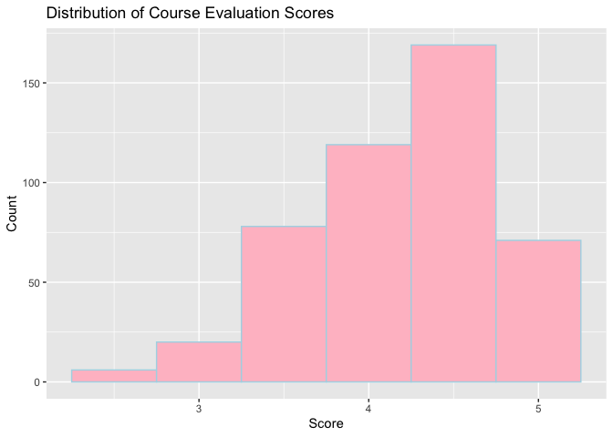
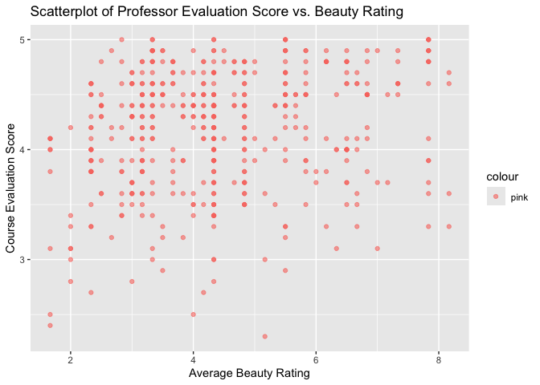
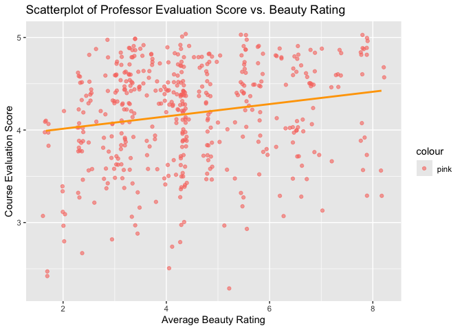

Lab 10 - Grading the professor, Pt. 1
================
Allison Li
04202025

## Load Packages and Data

``` r
##install.packages("openintro")
library(tidyverse) 
library(tidymodels)
library(openintro)
```

## Exercise 1

``` r
glimpse(evals)
```

    ## Rows: 463
    ## Columns: 23
    ## $ course_id     <int> 1, 2, 3, 4, 5, 6, 7, 8, 9, 10, 11, 12, 13, 14, 15, 16, 1…
    ## $ prof_id       <int> 1, 1, 1, 1, 2, 2, 2, 3, 3, 4, 4, 4, 4, 4, 4, 4, 4, 5, 5,…
    ## $ score         <dbl> 4.7, 4.1, 3.9, 4.8, 4.6, 4.3, 2.8, 4.1, 3.4, 4.5, 3.8, 4…
    ## $ rank          <fct> tenure track, tenure track, tenure track, tenure track, …
    ## $ ethnicity     <fct> minority, minority, minority, minority, not minority, no…
    ## $ gender        <fct> female, female, female, female, male, male, male, male, …
    ## $ language      <fct> english, english, english, english, english, english, en…
    ## $ age           <int> 36, 36, 36, 36, 59, 59, 59, 51, 51, 40, 40, 40, 40, 40, …
    ## $ cls_perc_eval <dbl> 55.81395, 68.80000, 60.80000, 62.60163, 85.00000, 87.500…
    ## $ cls_did_eval  <int> 24, 86, 76, 77, 17, 35, 39, 55, 111, 40, 24, 24, 17, 14,…
    ## $ cls_students  <int> 43, 125, 125, 123, 20, 40, 44, 55, 195, 46, 27, 25, 20, …
    ## $ cls_level     <fct> upper, upper, upper, upper, upper, upper, upper, upper, …
    ## $ cls_profs     <fct> single, single, single, single, multiple, multiple, mult…
    ## $ cls_credits   <fct> multi credit, multi credit, multi credit, multi credit, …
    ## $ bty_f1lower   <int> 5, 5, 5, 5, 4, 4, 4, 5, 5, 2, 2, 2, 2, 2, 2, 2, 2, 7, 7,…
    ## $ bty_f1upper   <int> 7, 7, 7, 7, 4, 4, 4, 2, 2, 5, 5, 5, 5, 5, 5, 5, 5, 9, 9,…
    ## $ bty_f2upper   <int> 6, 6, 6, 6, 2, 2, 2, 5, 5, 4, 4, 4, 4, 4, 4, 4, 4, 9, 9,…
    ## $ bty_m1lower   <int> 2, 2, 2, 2, 2, 2, 2, 2, 2, 3, 3, 3, 3, 3, 3, 3, 3, 7, 7,…
    ## $ bty_m1upper   <int> 4, 4, 4, 4, 3, 3, 3, 3, 3, 3, 3, 3, 3, 3, 3, 3, 3, 6, 6,…
    ## $ bty_m2upper   <int> 6, 6, 6, 6, 3, 3, 3, 3, 3, 2, 2, 2, 2, 2, 2, 2, 2, 6, 6,…
    ## $ bty_avg       <dbl> 5.000, 5.000, 5.000, 5.000, 3.000, 3.000, 3.000, 3.333, …
    ## $ pic_outfit    <fct> not formal, not formal, not formal, not formal, not form…
    ## $ pic_color     <fct> color, color, color, color, color, color, color, color, …

``` r
##Distribution:
ggplot(evals, aes(x = score)) +
  geom_histogram(
    binwidth = 0.5, fill = "pink", color = "lightblue") +
  labs(title = "Distribution of Course Evaluation Scores", x = "Score", y = "Count")
```

<!-- -->

This is a left skewed distribution, indicating that most students’
average professor evaluation scores were relatively good (4-5,
excellent). This is what I expected since I believe most professors are
good at teaching classes, while very little students indicating neutral
or negative attitudes towards their professions.

## Exercise 2

``` r
ggplot(evals, aes(x=bty_avg, y=score, color = "pink")) + 
  geom_point(alpha = .6) +
  labs(
    title = "Scatterplot of Professor Evaluation Score vs. Beauty Rating",
    x = "Average Beauty Rating",
    y = "Course Evaluation Score"
  )
```

<!-- -->

According to the graph, most dotes clustered on lower average beauty
rating and higher course evaluation scores.

## Exercise 3

``` r
ggplot(evals, aes(x=bty_avg, y=score, color = "pink")) + 
  geom_jitter(alpha = .6) +
  labs(
    title = "Scatterplot of Professor Evaluation Score vs. Beauty Rating",
    x = "Average Beauty Rating",
    y = "Course Evaluation Score"
  )
```

<!-- -->

This graph looks less ‘organized’. This introduction of Jitter
(<https://ggplot2.tidyverse.org/reference/geom_jitter.html>) here
indicates that it is a convenient shortcut for geom_point that adds a
small amount of random variation to the location of each point. It can
handle the overplotting since it adds a small amount of random noise to
data to spread out the dots so we can see clearly how many dots there
are in the same places. Although we have adjusted the alpha level, we
can see from this graph better that most dots are lying in around 4 for
average beauty rating and 4-5 around course evaluation score.

## Exercise 4

``` r
m_bty <- lm(
  score ~ bty_avg,
  data = evals
)
summary(m_bty)
```

    ## 
    ## Call:
    ## lm(formula = score ~ bty_avg, data = evals)
    ## 
    ## Residuals:
    ##     Min      1Q  Median      3Q     Max 
    ## -1.9246 -0.3690  0.1420  0.3977  0.9309 
    ## 
    ## Coefficients:
    ##             Estimate Std. Error t value Pr(>|t|)    
    ## (Intercept)  3.88034    0.07614   50.96  < 2e-16 ***
    ## bty_avg      0.06664    0.01629    4.09 5.08e-05 ***
    ## ---
    ## Signif. codes:  0 '***' 0.001 '**' 0.01 '*' 0.05 '.' 0.1 ' ' 1
    ## 
    ## Residual standard error: 0.5348 on 461 degrees of freedom
    ## Multiple R-squared:  0.03502,    Adjusted R-squared:  0.03293 
    ## F-statistic: 16.73 on 1 and 461 DF,  p-value: 5.083e-05

Looking at the summary of the model, the function should look like:
score = 3.8803 + .0666 × bty_avg

## Exercise 5

``` r
ggplot(evals, aes(x=bty_avg, y=score, color = "pink")) + 
  geom_jitter(alpha = .6) +
  geom_smooth(method = "lm", se = FALSE, color = "orange", size = 1) +
  labs(
    title = "Scatterplot of Professor Evaluation Score vs. Beauty Rating",
    x = "Average Beauty Rating",
    y = "Course Evaluation Score"
  )
```

    ## Warning: Using `size` aesthetic for lines was deprecated in ggplot2 3.4.0.
    ## ℹ Please use `linewidth` instead.
    ## This warning is displayed once every 8 hours.
    ## Call `lifecycle::last_lifecycle_warnings()` to see where this warning was
    ## generated.

    ## `geom_smooth()` using formula = 'y ~ x'

<!-- -->

I am not sure why turning off the shading, but shading represents the
95% confidence interval for the regression line. I speculate that taking
that off because it is not our focus for the visualization and it might
distract people.

## Exercise 6

the slope suggests that higher average beauty rating of the professor is
related with / can predict (?) slightly higher course evaluation scores.

## Exercise 7

the intercept represents the according course evaluation scores for a
professor who has a beauty rating of 0. I do not think it has any
meaning in this context since no one has rated the beauty rating as 0 so
the according course evaluation scores do not mean anything.

## Exercise 8

the R2 value here is .04, indicating that the beauty rating explains
only a small fraction (4%) of the variation in course evaluation rating
scores.

# Part 3

## Exercise 9

``` r
m_gen <- lm(score ~ gender, data = evals)
summary(m_gen)
```

    ## 
    ## Call:
    ## lm(formula = score ~ gender, data = evals)
    ## 
    ## Residuals:
    ##      Min       1Q   Median       3Q      Max 
    ## -1.83433 -0.36357  0.06567  0.40718  0.90718 
    ## 
    ## Coefficients:
    ##             Estimate Std. Error t value Pr(>|t|)    
    ## (Intercept)  4.09282    0.03867 105.852  < 2e-16 ***
    ## gendermale   0.14151    0.05082   2.784  0.00558 ** 
    ## ---
    ## Signif. codes:  0 '***' 0.001 '**' 0.01 '*' 0.05 '.' 0.1 ' ' 1
    ## 
    ## Residual standard error: 0.5399 on 461 degrees of freedom
    ## Multiple R-squared:  0.01654,    Adjusted R-squared:  0.01441 
    ## F-statistic: 7.753 on 1 and 461 DF,  p-value: 0.005583

According to the tables, the reference level is female. The coefficients
tell us that from female to male professors, there is a 0.14 increase in
the course evaluation rating scores. More specifically, the average
course evaluation score for female professors are 4.09 while 4.23 for
male professors.

## Exercise 10

For male: score = 4.0928 + .1415 × 1 For female: score = 4.0928 + .1415
× 0

## Exercise 11

``` r
m_rank <- lm(score ~ rank, data = evals)
summary(m_rank)
```

    ## 
    ## Call:
    ## lm(formula = score ~ rank, data = evals)
    ## 
    ## Residuals:
    ##     Min      1Q  Median      3Q     Max 
    ## -1.8546 -0.3391  0.1157  0.4305  0.8609 
    ## 
    ## Coefficients:
    ##                  Estimate Std. Error t value Pr(>|t|)    
    ## (Intercept)       4.28431    0.05365  79.853   <2e-16 ***
    ## ranktenure track -0.12968    0.07482  -1.733   0.0837 .  
    ## ranktenured      -0.14518    0.06355  -2.284   0.0228 *  
    ## ---
    ## Signif. codes:  0 '***' 0.001 '**' 0.01 '*' 0.05 '.' 0.1 ' ' 1
    ## 
    ## Residual standard error: 0.5419 on 460 degrees of freedom
    ## Multiple R-squared:  0.01163,    Adjusted R-squared:  0.007332 
    ## F-statistic: 2.706 on 2 and 460 DF,  p-value: 0.06786

According to the results, the reference level is teaching. The equation:
score = 4.28431 − .12968 × tenure track − .14518 × tenured. This
equation indicates that teaching professors are predicted to have an
average score of 4.28. From teaching to tenure track professors, there
is a .13 decrease in the average course evaluation rating scores.
However, according to the p value, this predictor is not statistically
significant, suggesting that the association is not meaningful.
Additionally, from teaching to tenured professors, there is a .15
decrease in the average course evaluation rating scores.

## Exercise 12

``` r
evals$rank_relevel <- relevel(evals$rank, ref = "tenure track") ##I asked GPT how to do this
```

## Exercise 13

``` r
m_rank_relevel <- lm(score ~ rank_relevel, data = evals)
summary(m_rank_relevel)
```

    ## 
    ## Call:
    ## lm(formula = score ~ rank_relevel, data = evals)
    ## 
    ## Residuals:
    ##     Min      1Q  Median      3Q     Max 
    ## -1.8546 -0.3391  0.1157  0.4305  0.8609 
    ## 
    ## Coefficients:
    ##                      Estimate Std. Error t value Pr(>|t|)    
    ## (Intercept)           4.15463    0.05214  79.680   <2e-16 ***
    ## rank_relevelteaching  0.12968    0.07482   1.733   0.0837 .  
    ## rank_releveltenured  -0.01550    0.06228  -0.249   0.8036    
    ## ---
    ## Signif. codes:  0 '***' 0.001 '**' 0.01 '*' 0.05 '.' 0.1 ' ' 1
    ## 
    ## Residual standard error: 0.5419 on 460 degrees of freedom
    ## Multiple R-squared:  0.01163,    Adjusted R-squared:  0.007332 
    ## F-statistic: 2.706 on 2 and 460 DF,  p-value: 0.06786

``` r
unique(evals$rank_relevel) # to double check
```

    ## [1] tenure track tenured      teaching    
    ## Levels: tenure track teaching tenured

According to the results, the reference level is tenured track The
equation: score = 4.15463 + .12968 × teaching − .01550 × tenured. This
equation indicates that tenure track professors are predicted to have an
average course evaluation score of 4.15. From tenure track to teaching
professors, there is a .13 increase in the average course evaluation
rating scores. However, according to the p value, this predictor is not
statistically significant, suggesting that the association is not
meaningful. Additionally, from tenure track to tenured professors, there
is a .02 decrease in the average course evaluation rating scores. This
predictor is also not statsitically significant, indicating the
prediction is not meaningful. In other words, there is no meaningful
evidence that scores differ between tenured and tenure track professors.
According to the R-squared value, the model explains only about 1.2% of
the variation in evaluation scores based on professor’s rank,indicating
that professor rank is not a strong predictor of course evaluation
scores.

## Exercise 14

``` r
evals <- evals %>%
  mutate(tenure_eligible = ifelse(rank %in% c("teaching"), "no", "yes"))
```

## Exercise 15

``` r
m_tenure_eligible <- lm(score ~ tenure_eligible, data = evals)
summary(m_tenure_eligible)
```

    ## 
    ## Call:
    ## lm(formula = score ~ tenure_eligible, data = evals)
    ## 
    ## Residuals:
    ##     Min      1Q  Median      3Q     Max 
    ## -1.8438 -0.3438  0.1157  0.4360  0.8562 
    ## 
    ## Coefficients:
    ##                    Estimate Std. Error t value Pr(>|t|)    
    ## (Intercept)          4.2843     0.0536  79.934   <2e-16 ***
    ## tenure_eligibleyes  -0.1406     0.0607  -2.315    0.021 *  
    ## ---
    ## Signif. codes:  0 '***' 0.001 '**' 0.01 '*' 0.05 '.' 0.1 ' ' 1
    ## 
    ## Residual standard error: 0.5413 on 461 degrees of freedom
    ## Multiple R-squared:  0.0115, Adjusted R-squared:  0.009352 
    ## F-statistic: 5.361 on 1 and 461 DF,  p-value: 0.02103

According to the results, the reference level is tenured track non
eligible (the teaching position). The equation: score = 4.2843 − .1406 ×
tenured eligible. This equation indicates that tenure track noneligible
(teaching) professors are predicted to have an average course evaluation
score of 4.28. From tenure non eligible track to eligible professors,
there is a .14 decrease in the average course evaluation rating scores.
This predicton is significant. According to the R-squared value, the
model explains only about 1.1% of the variation in evaluation scores
based on professor’s rank, indicating that professor rank is not a
strong predictor (but significant) of course evaluation scores.
